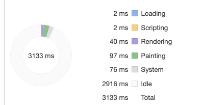
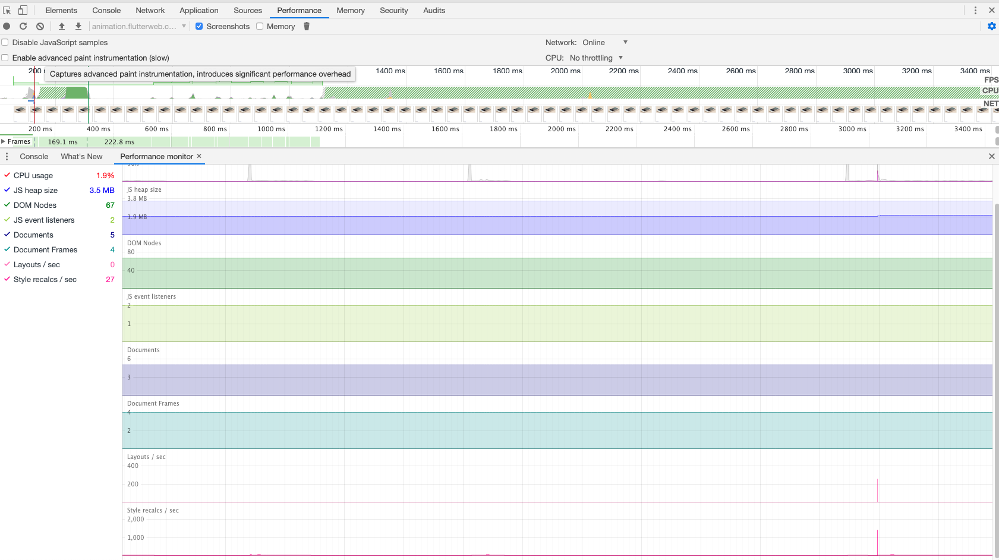
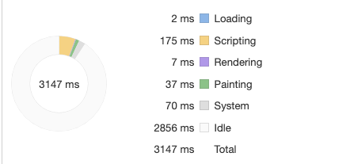
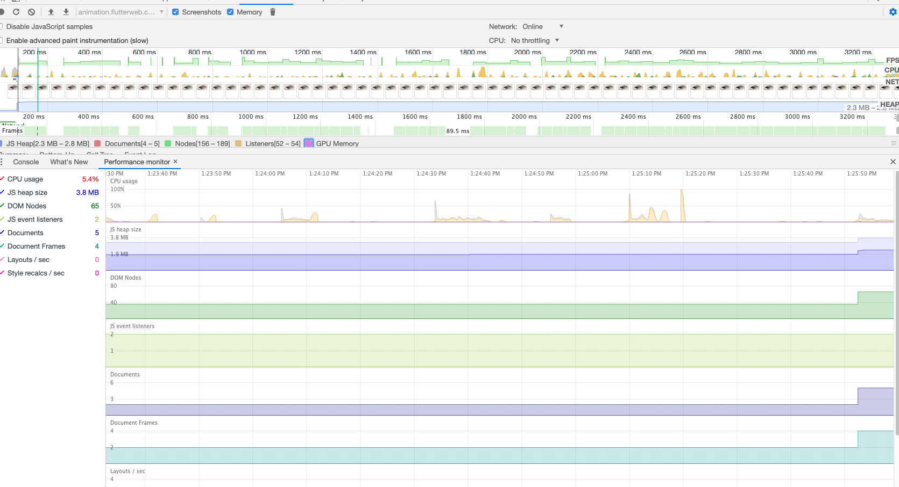
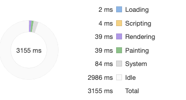
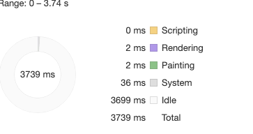
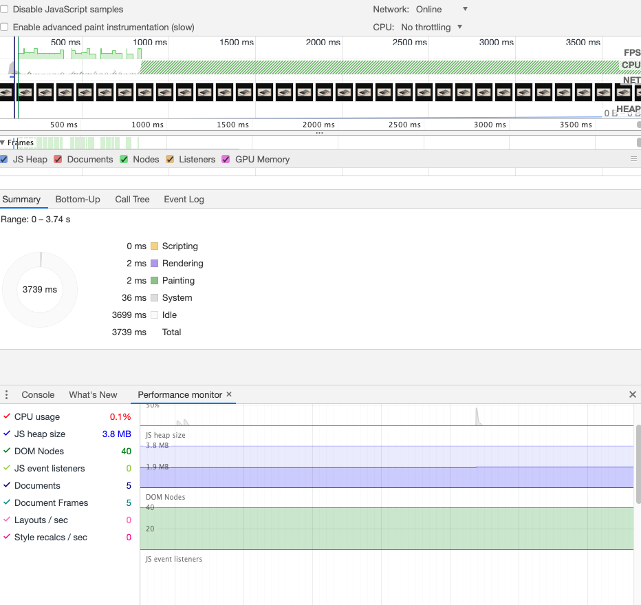

# 前端动画方案对比

**目录**
[[toc]]

## 一、通过AE+GKA，一键制作前端动画

### 思路
前端动画之前都是设计给动画，然后一帧一帧的去调，中间会出现反复的协商调整。

而通过AE导致每一帧图片，然后再利用GKA npm插件，一键导出css/canvas/svg/createJs 动画，效果还是非常不错的。gka,还可以自动生成雪碧图，代码压缩。简直是前端制作动画的神器。

### 参考文章
下面是我参照的文章，然后自己做了一个demo：

**初识Adobe After Effects效果制作**： <https://aotu.io/notes/2015/12/29/ae/>

ps: AE动画小巧挺多的，可以动手照着做一个，加强对于AE的了解，不难，挺像ps的。

**GKA官网**：<https://gka.js.org/#/>

gka使用超级简单
::: tip
**增加模板**

模板支持动态增加，只需安装需要的模板。即时安装，即刻可用。

npm i gka-tpl-模板名 -g
使用示例
对 E:\img 目录中的图片进行处理。

**快速生成帧动画**

gka E:\img
进行图片去重、合图优化，输出 css 动画文件
gka E:\img -us
进行图片去重、空白裁剪、合图优化，使用 canvas 模板，输出 canvas 动画文件
gka E:\img -ucs -t canvas
:::

###  DEMO
下面是我制作的demo,丑是丑了点，但是原理实现了

这是通过Adobe After Effects制作的效果

通过AE导出每一帧图片，然后通过GKA生成的效果。
扫描二维码可以查看效果

最下面的gif图片，是通过ps合成的。

## 二、不同动效性能分析

### 使用教程链接
帧动画的多种实现方式与性能对比 - 掘金 :<https://juejin.im/post/5c7bd2646fb9a049cb197921>

### 流畅动画的标准
::: tip
首先，理清一些概念。FPS 表示的是每秒钟画面更新次数。我们平时所看到的连续画面都是由一幅幅静止画面组成的，每幅画面称为一帧，FPS 是描述“帧”变化速度的物理量。

理论上说，FPS 越高，动画会越流畅，目前大多数设备的屏幕刷新率为 60 次/秒，所以通常来讲 FPS 为 60 frame/s 时动画效果最好，也就是每帧的消耗时间为 16.67ms。

直观感受，不同帧率的体验：

	• 帧率能够达到 50 ～ 60 FPS 的动画将会相当流畅，让人倍感舒适；
	• 帧率在 30 ～ 50 FPS 之间的动画，因各人敏感程度不同，舒适度因人而异；
	• 帧率在 30 FPS 以下的动画，让人感觉到明显的卡顿和不适感；

帧率波动很大的动画，亦会使人感觉到卡顿。
::: 

### 上面demo的性能对比

#### FPS
通过安装chrome应用商店插件：FPS 。

各个动画的帧率都能达到60 FPS,运行起来都比较流程。

### 谷歌浏览器的performance ,性能分析

参照的教程：

chrome- Performance： <https://zhuanlan.zhihu.com/p/41017888>

### 性能分析的心得

#### gif的缺陷

    a. 无法产生渐变的效果，内部效果接近于0-1，无过渡。原因是：gif只有透明和不透明两种状态  没有半透明状态。

        ps: 如果有那种透明度变化的效果，就不能采用gif的方式了。

    b. 单张图还是比较大，gif图, 需要手动的优化，时间成本较高。

#### css 以及 canvas

动效方案采用较多的是css以及canvas。 css主要调用GPU支持，消耗较多的显卡的性能。而canvas主要调用CPU,通过js在canvas画布上进行绘制。

**整体的性能表现，css及canvas渲染时间差不多,表现也比较接近。具体应用场景还是要考虑设备的性能。**

### 下面是性能表现数据（实测）
#### css 性能表现

#### canvas 性能表现

#### svg 性能表现

#### gif 性能表现

## 三、AE +Bodymovin + lottie 制作前端动画的方案

### 参考资料

2019腾讯开发者大会-探索动效开发模式(淘宝大漠)： 

视频地址： <https://m.ke.qq.com/course/436773?_bid=167&_wv=1&taid=3699830858099237>

pdf地址： <https://github.com/zhongwangquan/ppts/blob/master/2019_TLC_ppts/ppt/%E5%A4%A7%E5%89%8D%E7%AB%AF%E4%B8%93%E5%9C%BA/%E5%A4%A7%E6%BC%A0/%E6%8E%A2%E7%B4%A2%E5%8A%A8%E6%95%88%E5%BC%80%E5%8F%91%E6%A8%A1%E5%BC%8F.pdf>

### 想要达成的效果

对于动画更精细的操作，而不只是播放一段动画。

开发者大会上，大漠说目前主要采用css+js的形式来进行动画。通过谷歌，推测他们采用的方案是：

AE +Bodymovin + lottie

#### 教程：

Lottie-前端实现AE动效:<https://juejin.im/post/5c8ddddce51d4563ed1efac9>

通过控制json数据，anm.goToAndPlay控制动画状态的切换，如下图例中一个JSON文件包含了2个动画状态的数据：

### 等有时间了再来实现下，跟上面的动画进行对比。